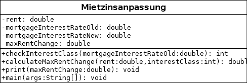

# Zulässige Mietzinsanpassung

Was gestützt auf eine Anpassung des Hypothekarzinses eine zulässige
Mietzinserhöhung ist, wird in [Art. 13 Abs. 1
VMWG](https://www.fedlex.admin.ch/eli/cc/1990/835_835_835/de#art_13)
geregelt: 

>**Art. 13 Hypothekarzinse**
>
>Eine Hypothekarzinserhöhung von einem Viertel Prozent berechtigt in der
>Regel zu einer Mietzinserhöhung von höchstens:
>
>a. 2 Prozent bei Hypothekarzinssätzen von mehr als 6 Prozent;
>
>b. 2,5 Prozent bei Hypothekarzinssätzen zwischen 5 und 6 Prozent;
>
>c. 3 Prozent bei Hypothekarzinssätzen von weniger als 5 Prozent.
>
>Bei Hypothekarzinssenkungen sind die Mietzinse entsprechend
>herabzusetzen oder die Einsparungen mit inzwischen eingetretenen
>Kostensteigerungen zu verrechnen.

Programmieren Sie eine Anwendung, mit welcher der aktuelle Mietzins, der
aktuelle [Referenzzinssatz des Bundesamtes für
Wohnungswesen](https://www.bwo.admin.ch/bwo/de/home/mietrecht/referenzzinssatz/entwicklung-referenzzinssatz-und-durchschnittszinssatz.html)
sowie dessen Erhöhung abgefragt werden und welches dann die maximal
zulässige Mietzinserhöhung zurückgibt.

Ihre Anwendung soll dabei das untenstehende Class Diagram umsetzen.

Klonen Sie dieses Ripository, benennen Sie es Mietzins-Name,
programmieren Sie Ihre Lösung in einem Feature Branch und geben Sie
diese ab in dem Sie einen Pull Request nach main mit mir als Reviewer machen.
